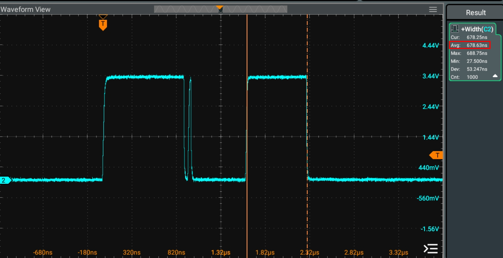

# Прикладная программа

## Общие сведения

Программа загружается в **OCM** с помощью [загрузчика](loader.md) на рантайме или с помощью отладочного интерфейса [при отладке](debug.md#debug-load). В обоих случаях выполняется основная инициализация аппаратуры как самого CPU, так и периферийных устройств. Это позволяет не делать это при запуске прикладной программы, что экономит память и сокращает время старта.

В данном случае программа не выполняет каких-либо полезных функций, а носит сугубо демонстрационный характер&nbsp;– является примером-шаблоном.

## Описание кода

В качестве тестового кода используется пример `2-message` из состава [**scmRTOS**](https://github.com/scmrtos/scmrtos-sample-projects/tree/develop/samples/cortex/zynq7k/2-message). Пример является достаточно минималистичным, он содержит:

  * инициализацию таблицы указателей на обработчики прерываний;
  * настройку контроллера прерываний (**GIC**);
  * настройку и запуск системного таймера RTOS;
  * инициализацию периферии (в данном примере используется только UART для печати на терминал);
  * запуск RTOS;
  * код процессов RTOS.

Пример демонстрирует динамические характеристики SoC с использованием **scmRTOS** в контексте скорости&nbsp;– времени передачи управления. В примере задействовано 3 процесса и средство межпроцессного взаимодействия `OS::message`. Самый приоритетный процесс является приёмником сообщений (как только возникает сообщение, этот процесс сразу же получает управление). Сообщения ему посылаются из двух источников: 

  1. хук системного таймера;
  1. другой, более низкоприоритетный процесс.

При получении сообщения процесс может из его содержимого определить источник. Время передачи управления можно определить длительности импульса на сигнале `JE2` (**Zedboard**): этот сигнал устанавливается в высокий уровень источником сообщения (хук прерывания системного таймера или низкоприоритетный процесс) и сбрасывается в процессе-приёмнике. Различать сообщения можно по форме сигнала: при получении сообщения от прерывания после установки `JE2` в низкий уровень формируется дополнительный импульс.

Ниже приведены результаты при следующей конфигурации SoC: выбрана схема тактирования 4:2:1, тактовые частоты:

    CPU_6x4x = 400 МГц;
    CPU_3x2x = 200 МГц;
    CPU_1x   = 100 МГц.

Среднее время передачи управления "прерывание-процесс" 896&nbsp;нс:

 

{style: width=800}

 

Среднее время передачи управления "процесс -процесс" 678&nbsp;нс:

 

{style: width=800}

 

Данный пример может быть использован как отправная точка при начале разработки любого рабочего проекта как с использованием данной RTOS (или любой другой), так и без неё.

