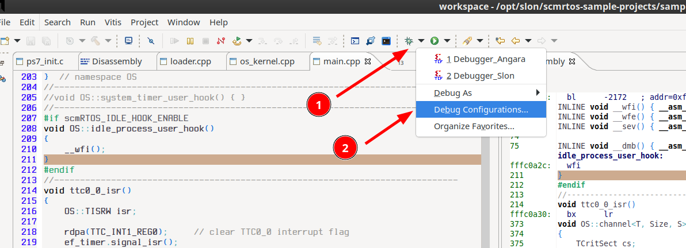
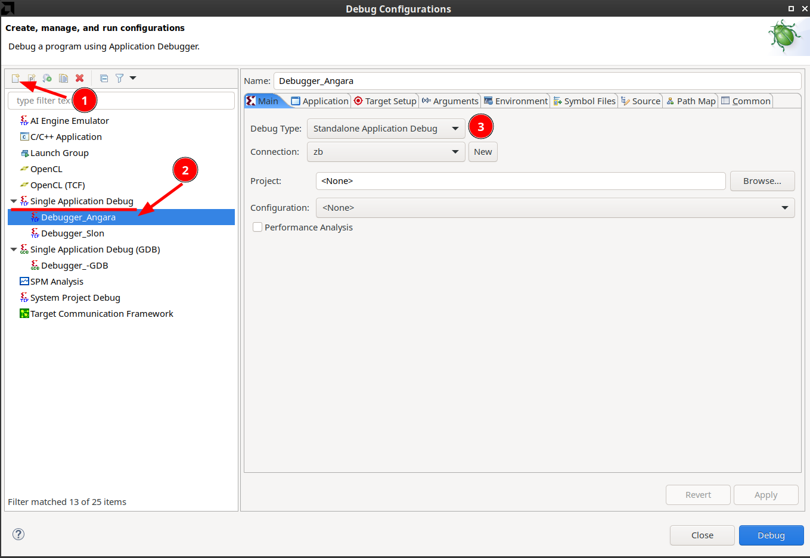
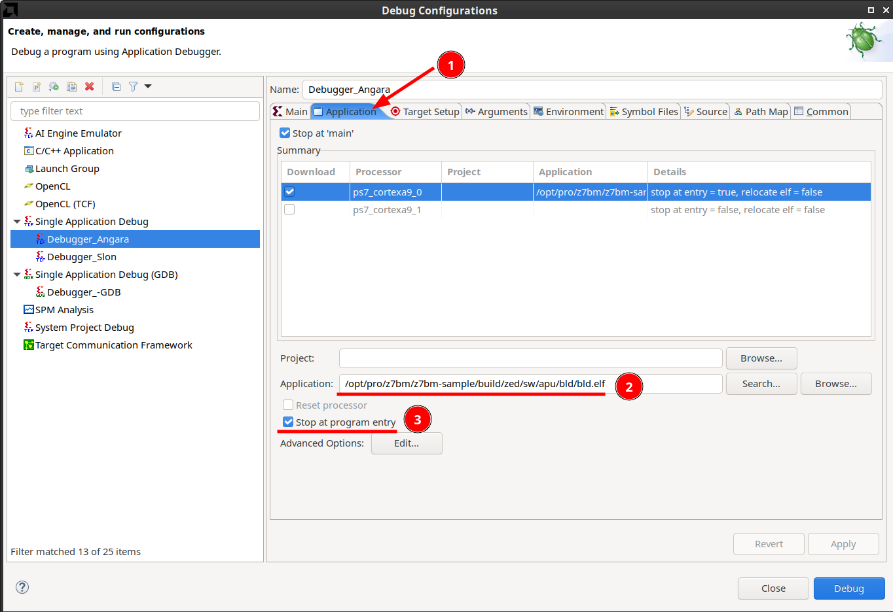
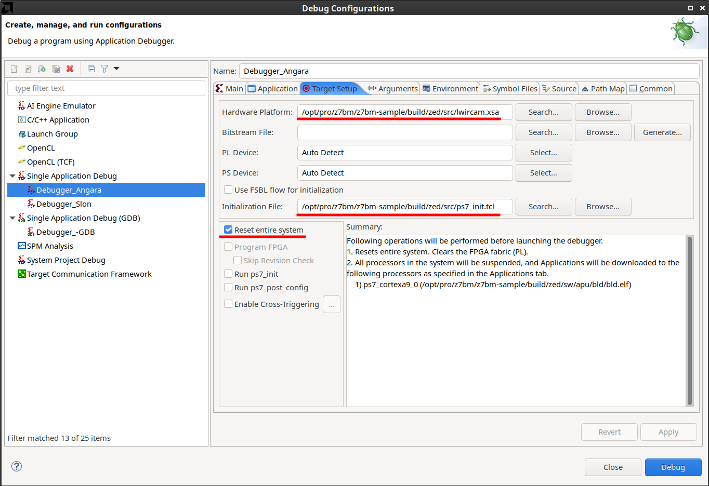

# Отладочные средства

## Создание и настройка отладочной сессии Vitis

### Отладочная конфигурация

Для осуществления процесса отладки с возможностью доступа ко внутренним ресурсам SoC необходимо создать отладочную сессию. Для этого требуется создать и настроить отладочную конфигурацию. Все действия выполняются средствами GUI **Vitis**.

!!! tip "**СОВЕТ**"

    Графическая оболочка **Vitis** при запуске использует системную тему оформления, и если эта тема тёмная, то отображение окон программы оказывается очень некомфортным&nbsp;– многие места является нечитаемыми из-за низкого контраста текста и фона. Исправить это путём настройки цветовой схемы в полной мере не удаётся, намного более простым и эффективным путём является указание темы при загрузке программы, например:

    ```
    GTK_THEME=Adwaita `<path-to-xilinx-tools>/Vitis/<version>//bin/vitis&
    ```

### Создание отладочной конфигурации

#### Диалог отладочных сессий

Первым действием является активация диалога отладочных сессий:
<br>

{style: width=800}

<br>

Далее, нужно создать отладочную конфигурацию, указав имя и тип:

<br>

{style: width=800}

<br>

Затем задать опции приложения: CPU, имя **ELF** образа.

{style: width=800}

<br>

И завершающие действия: задать файл Hardware Platform (.xsa), файл скрипта инициализации и другие опции:

{style: width=800}

<br>

Файл .xsa является zip-архивом, содержащим набор файлов описания аппаратной платформы&nbsp;– описания сигналов, исходный код инициализации регистров периферии и т.д. Этот файл генерируется системой сборки в `build/src`.

Скрипт инициализации (`ps7_init.tcl`) осуществляет действия, аналогичные выполняемым на рантайме при вызове функции `pc7_init()` (исходный код в файле `ps7_init.c`). Этот скрипт полезен, когда требуется запустить приложение (.elf) без использования загрузчика, что обычно и нужно при отладке. В описываемом сценарии&nbsp;– тандемный запуск "загрузчик-прикладная программа"&nbsp;– использование этого скрипта не требуется, т.к. загрузчик выполняет нужные действия с помощью штатной `ps7_init()`. Тем не менее, указать путь к этому скрипту необходимо, т.к. без него отладочная сессия не запускается, выдавая ошибку:

```
11:21:04 ERROR  : Initialization file is not found. Cannot run initialization.
```

!!! info "**ЗАМЕЧАНИЕ**"

    Отладочная сессия **Vitis** не является необходимой для загрузки и запуска программы в SoC, это можно сделать, например, с помощью команд консоли `xsct`:

    ```
    <path-to-xilinx-tools>/Vitis/<version>/bin/xsct
    ```

    При этом необходимо, чтобы hardware server был запущен. При запуске отладочной сессии его запускает **Vitis**. В случае без использования **Vitis** hardware server предварительно нужно запустить руками (как это делается, описано в официальной документации).

    Пример загрузки с помощью консоли `xsct` показан ниже.

<a name="debug-load"></a>
## Загрузка в режиме отладки

В процессе разработки значительно удобнее и быстрее запускать код путём непосредственной загрузки образов (**ELF**) в память SoC. Для корректной работы необходимо проимитировать процесс штатной загрузки, который состит из двух этапов:

  1. запуск загрузчика (это часть, которой посвящен данный раздел);
  1. запуск прикладной программы.

В результате работы загрузчика и непосредственно перед запуском прикладной программы SoC находится в следующем состоянии:

  * низкоуровневая инициализация (**SCU**, **MMU**, кэши) выполнена;
  * все четыре сегмента **OCM** размещены по адресу `0xfffc0000` в виде непрерывной области памяти.
  * таблица векторов прерываний размещена по адресу `0xfffc0000`;
  * таблица трансляции **MMU** находится по адресу `0xffffc000`[^1];
  * инициализация периферийных устройств PS части SoC выполнена загрузчиком (файл `ps7_init.c`).

Всю эту работу осуществил загрузчик, и проэмулировать его работу средствами отладки весьма проблематично. С другой стороны, программировать флешь память при каждой отладочной итерации является неудачным решением: это затратно по времени, это расходует ресурс флешь памяти и, главное, теряется (или сильно затрудняется) возможность иметь доступ к отладочным средствам в виде инспекции объектов программы, установки точек останова и т.п.

Поэтому для организации отладочной сессии применяется следующий сценарий. Хост:

  1. производит сброс SoC;
  1. загружает (через JTAG) образ загрузчика (**ELF**);
  1. устанавливает точку останова на функции `load_img`;
  1. запускает программу загрузчика;
  1. дожидается останова работы программы, что означает, что загрузчик остановился в точке перед непосредственно загрузкой прикладной программы из флешь памяти;
  1. удаляет точки останова;
  1. загружает образ прикладной программы (вместо `load_img`);
  1. запускает работу программы.

  Описанный сценарий в виде **Tcl** скрипта, пригодный для запуска из консоли **xsct**:

```tcl
  proc rl { } {
    rst
    dow build/zed/sw/apu/bld/bld.elf
    bpadd load_img
    con
    while { [state] == "Running" } {

    }
    bpremove -all

    dow build/zed/sw/apu/cam/cam.elf

    con
}
```

Таким образом, описанный алгоритм эмулирует работу связки "загрузчик-прикладная программа", позволяя при этом иметь все возможности пользоваться отладочными средствами благодаря тому, что в SoC заргужен полноценный образ **ELF**.
