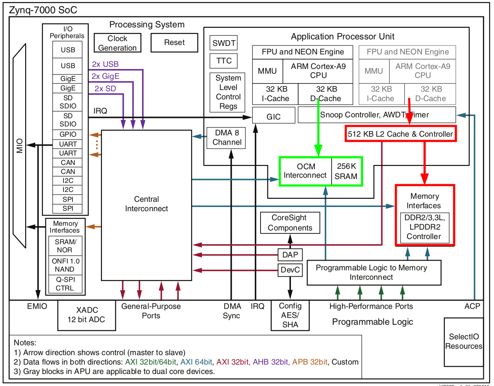

# Реализация

## Концепция

### Размещение в памяти

Основная идея для достижения быстрой и предсказуемой работы программы состоит в том, чтобы разместить код и данные программы во внутренней памяти SoC&nbsp;– OCM (On-Chip Memory), см. изображение ниже (выделено зелёным).

OCM SoC **Zynq-7000** имеет размер 256 килобайт и располагается на уровне L2&nbsp;– это ближайший уровень к CPU. В случае промаха кэшей L1 задержка обращения к памяти будет ограничена временем доступа в OCM. 

При размещении программы/данных во внешней памяти при промахе кэша L1 будет произведено обращение в кэш L2, при промахе в нём далее будет осуществляться доступ к внешней памяти посредством контроллера DDR (выделено красным)&nbsp;– результат этого подробно описан [в предыдущем разделе](index.md#benchmarks).

{stype: width=800}

 

ОСМ в SoC **Zynq-7000** является статическим ОЗУ (оперативное запоминающее устройство&nbsp;– RAM:
Random-Access Memory), имеет объём 256 кбайт и представлена в виде четырёх сегментов  по 64 кбайт
размером каждый. При включении эти сегменты распределены следующим образом: три сегмента
располагаются подряд, начиная с адреса `0x00000000`, и один сегмент в конце адресного пространства
с адреса `0xffff0000`.

Такое разделение не имеет никаких достоинств для bare-metal программы, напротив&nbsp;– это снижает эффективность и удобство разработки, поэтому на этапе загрузки производится перемещение трёх сегментов с адреса `0x00000000` в конец адресного пространства так, чтобы все четыре сегмента образовывали единый непрерывный сегмент ОЗУ, расположенный по адресу `0xfffc0000`. Эти действия выполняются [загрузчиком](loader.md) после инициализации непосредственно перед загрузкой пользовательской программы в OCM.

### Начальная загрузка

Работа SoC начинается с процесса начальной загрузки, состоящей из из двух этапов:

  1. инициализация аппаратуры процессора (кэши, MMU), контроллера прерываний, периферийных устройств, включая контроллер DDR;
  1. конфигурация целевой памяти (ОСМ) и загрузка прикладной программы в неё.

Благодаря наличию загрузчика имеется возможность произвести инициализацию периферии и статическую инициализацию переменных на этапе загрузки прикладной программы&nbsp;– это позволит уменьшить размер используемой памяти.

Все эти действия выполняются загрузчиком, работа которого [подробно описана в соответствующем разделе](loader.md).

## Состав комплекта

Поддержка разработки ПО в режиме bare-metal содержит следующие компоненты:

  * загрузчик;
  * библиотеки;
  * шаблон прикладной программы со средствами автоматизированной сборки.

Все эти части подробно описаны далее.

