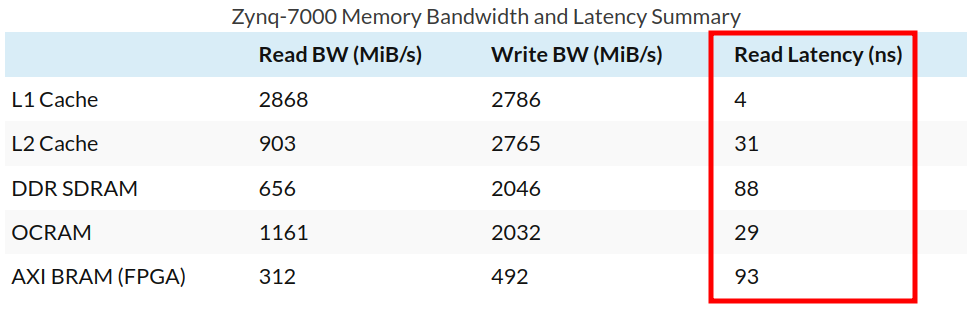
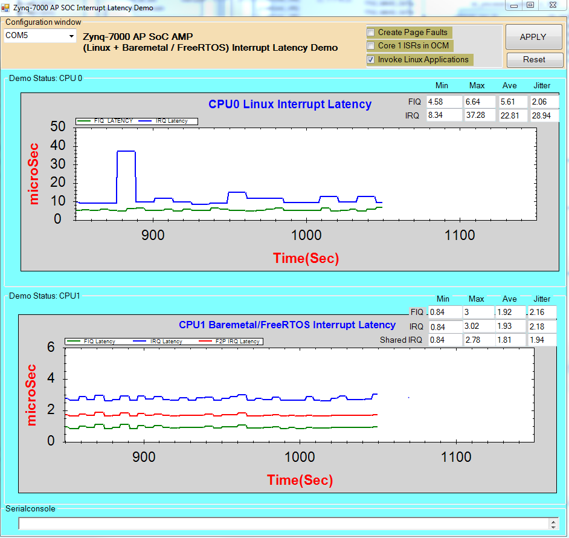

# Zynq-7000 Baremetal

## Назначение

Проект **Zynq-7000 Baremetal** преследует цель подготовить основу для запуска проектов с использованием SoC семейства **Zynq-7000** ф. **Xilinx** в режиме bare-metal. 

## Мотивация

Bare-metal (на "голом железе") означает без использования операционной системы (ОС) класса **Linux**, т.е. разработка программного ведётся с непосредственным использованием аппаратуры SoC. Использование операционных систем реального времени (ОСРВ&nbsp;– RTOS&nbsp;– Real-Time Operating System) не меняет статуса bare-metal, т.к. взаимодействие с аппаратной частью SoC в этом случае происходит точно так же, как без ОСРВ.

!!! info "**ЗАМЕЧАНИЕ**"

    Не является секретом, что подобные SoC предназначены в первую очередь для построения программной части на основе ОС **Linux** в embedded варианте[^1]. Сами производители SoC рекомендуют использовать именно такой способ, предлагая "заготовки" для его реализации: 

      * рекомендованная версия ядра **Linux**;
      * патчи ядра;
      * загрузчик первого уровня (старт процессора и начальная инициализации аппаратуры SoC);
      * загрузчик образов ядра, корневой файловой системы и т.п. (как правило, это **uboot**);
      * дерево устройств (Device Tree);
      * драйверы устройств данного SoC.

    Перечисленные компоненты содержат в себе большой объём проделанной работы по реализации поддержки аппаратной части SoC со стороны программного обеспечения (ПО). Сложность указанной работы состоит в том, что SoC сама по себе обычно строится на основе CPU класса Application Processor с кэшами, MMU (memory-managemet unit) и т.п., а также содержит множество сложных блоков, включая коммутаторы шин, контроллер внешней DDR памяти, периферийные устройства, способные работать без задействованная CPU (или с минимальным задействованием), аппаратные каналы передачи данных между памятью и периферийными устройствами (контроллеры DMA), сложные контроллеры прерываний и другую специализированную аппаратуру, и всё это требуется корректно включить, проинициализировать и предоставить возможность простого использования при запуске прикладных программ.

    Это является, как правило, непростой задачей из-за необходимости учитывать множество особенностей специализированной аппаратуры. Рекомендованный производителями SoC подход и его поддержка во многом снимают эту сложность с пользователя&nbsp;– это и является **главной причиной популярности использования Linux**: ОС и её поддержка (загрузчики, драйвера) **абстрагируют прикладное ПО от нюансов взаимодействия со сложной аппаратурой SoC**.

При всех преимуществах подхода с использованием ОС **Linux** он обладает существенными недостатками при работе в масштабе реального времени, к которым можно отнести следующие:

  * существенно худшая предсказуемость времени реакции на события по сравнению с режимом "bare
    metal";
  * большое время загрузки, как правило измеряемое десятками секунд[^2];
  * относительно большой объём&nbsp;– требовательность к ресурсам (производительность процессора,
    объём и скорость работы памяти)[^3].

### Количественные оценки

Задержки обращения в память (приведены для операций чтения) в режиме bare-metal&nbsp;– т.е. то, что может обеспечить аппаратура ([источник](https://www.jblopen.com/zynq-benchmarks/)), значения приведены в тактах CPU:

{style: width=600}

Видно, что задержка доступа в OCM и кэш L2 примерно одинаковы, т.к. они находятся на одном уровне. При этом доступ в DDR оказывается в три раза дольше, и это оптимистичная оценка&nbsp;– в банк и страница DDR находятся в активном состоянии, поэтому тут задержка только на "транспорте" (интерконнектах, тракте контроллера памяти и интерфейсе памяти). В случае промаха банка/страницы задержка будет больше.

Но **самое важное в обсуждаемом контексте&nbsp;– это время реакции на прерывание**, т.к. именно это обуславливает время реакции на события. И тут помимо задержек работы собственно контроллера прерываний и транспортных задержек доступа в память начинают в полный рост влиять такие факторы как промахи кэшей L2, банков/страниц DDR, промахи TLB, инвалидация предсказателя ветвлений. Результаты тестов приведены в таблице ([источник](https://www.jblopen.com/arm-cortex-a-interrupt-latency/), значения приведены в тактах CPU):

| Configuration  | Scenario           | Min  | Max  | Avg      |
| -------------- | ------------------ | ---- | ---- | -------- |
| DDR Cached     | Normal             | 242  | 242  | 242      |
| DDR Cached     | TLB Invalidate     | 326  | 496  | 328      |
| DDR Cached     | BP Invalidate      | 298  | 298  | 298      |
| DDR Cached     | TLB+BP Invalidate  | 384  | 478  | 396      |
| DDR Cached     | L1I Clean          | 400  | 414  | 404      |
| DDR Cached     | L1D Clean          | 396  | 420  | 408      |
| DDR Cached     | L1 D+I Clean       | 532  | 580  | 546      |
| DDR Cached     | L2 Clean           | 242  | 242  | 242      |
| DDR Cached     | L1+L2 Clean        | 1582 | 2978 | 1844     |
| DDR Cached     | L1+L2+BP+TLB Clean | 1746 | 2896 | 1892     |
| OCRAM Cached   | Normal             | 240  | 240  | 240      |
| OCRAM Cached   | TLB Invalidate     | 242  | 242  | 242      |
| OCRAM Cached   | BP Invalidate      | 298  | 298  | 298      |
| OCRAM Cached   | TLB+BP Invalidate  | 298  | 298  | 298      |
| OCRAM Cached   | L1I Clean          | 402  | 424  | 410      |
| OCRAM Cached   | L1D Clean          | 424  | 462  | 448      |
| OCRAM Cached   | L1 D+I Clean       | 588  | 620  | 600      |
| OCRAM Cached   | L2 Clean           | 240  | 240  | 240      |
| OCRAM Cached   | L1+L2 Clean        | 592  | 620  | 594      |
| OCRAM Cached   | L1+L2+BP+TLB Clean | 580  | 626  | 596      |

Такая большая разница в значениях обусловлена разными условиями работы кэшей, TLB, предсказателя ветвлений, а именно эти факторы и имеют место непредсказуемым образом при возникновении прерываний.

Сводная таблица наихудших значений:

| Configuration  | Scenario           | Min  | Max  | Avg      |
| -------------- | ------------------ | ---- | ---- | -------- |
| DDR Cached     | L1+L2+BP+TLB Clean | 1746 | 2896 | 1892     |
| OCRAM Cached   | L1+L2+BP+TLB Clean | 580  | 626  | 596      |

Ожидаемо результат для OCM в 4-5 раз лучше (рассматривается наихудший случай), чем для DDR. Приведённые результаты получены в синтетических тестах, в реальной системе с **Linux** разница будет ещё радикальнее ([источник](https://xilinx-wiki.atlassian.net/wiki/spaces/A/pages/18842218/Zynq-7000+AP+SoC+-+RealTime+-+InterruptLatency+Reference+Design+and+Demo+Tech+Tip)):

 

{style: width=800}

Картина достаточно красноречива и наглядно показывает разброс задержек. 

!!! warning "ВАЖНОЕ ЗАМЕЧАНИЕ"

    В контексте **Linux** стоит добавить ещё, что если программа работает в пользовательском пространстве (userspace), то передача информации из прерывания через сервисы ядра ещё добавит заметную задержку, а момент, когда планировщик ОС передаст этой программе управление, практически не поддаётся точной оценке&nbsp;– на это влияет большое количество факторов: от загруженности процессора и количества процессов в системе до приоритета работы программы.

    Для достижения результатов по задержкам реакции на события хотя бы соответствующим представленным выше, код работы с прерываниями, который обслуживает события, должен работать в пространстве ядра ОС&nbsp;– например, быть модулем ядра. А это означает разработку по сути bare-metal программы, но работающую в значительно более сложном окружении с множеством ограничений, налагаемых им. Т.е. при таком подходе выигрыша нет ни по эффективности работы программы, ни по удобству и простоте разработки.

Учитывая всё вышесказанное, становится очевидным основной мотив описываемого подхода:

!!! tip "**ЦЕЛЬ**"

    **Главным мотивом использования режима bare-metal является стремление**:

      * достичь максимально предсказуемой работы CPU SoC в контексте реального времени;
      * иметь минимальное время старта прибора.
  

К серьёзным недостаткам bare-metal подхода можно отнести то, что в этом варианте работа с инициализацией, настройкой и обслуживанием всей этой сложной аппаратной инфраструктурой&nbsp;– кэши, MMU, система прерываний и т.п. ложится на разработчика. Это цена за более предсказуемый, управляемый и эффективный результат.

[^1]: Это не полноценный дистрибутив, а специализированная сборка ядра, загрузчика, корневой файловой системы, дерева устройств и т.д., хотя ряде случаев бывает удобно взять готовый дистрибутив, если производительности и ресурсов целевой платы для этого достаточно.

[^2]: Оптимизацией и некоторыми специальными методами можно достичь времени загрузки в единицы секунд, но это потребует ряда ограничений, что не всегда приемлемо, и полученный результат всё равно не сравнится с bare-metal режимом.

[^3]: Этот пункт влияет на работу в масштабе реального времени косвенно, отражаюсь на первых двух: из-за большого объёма код и данные размещаются во внешней DDR, что при промахах кэша будет приводить к многократному росту задержки обращения, а это вносит тут самую непредсказуемость во время реакции на событие. Кроме того, в это вносят свой существенный вклад большое количество запущенных процессов и сложность механизмов работы планировщика.
